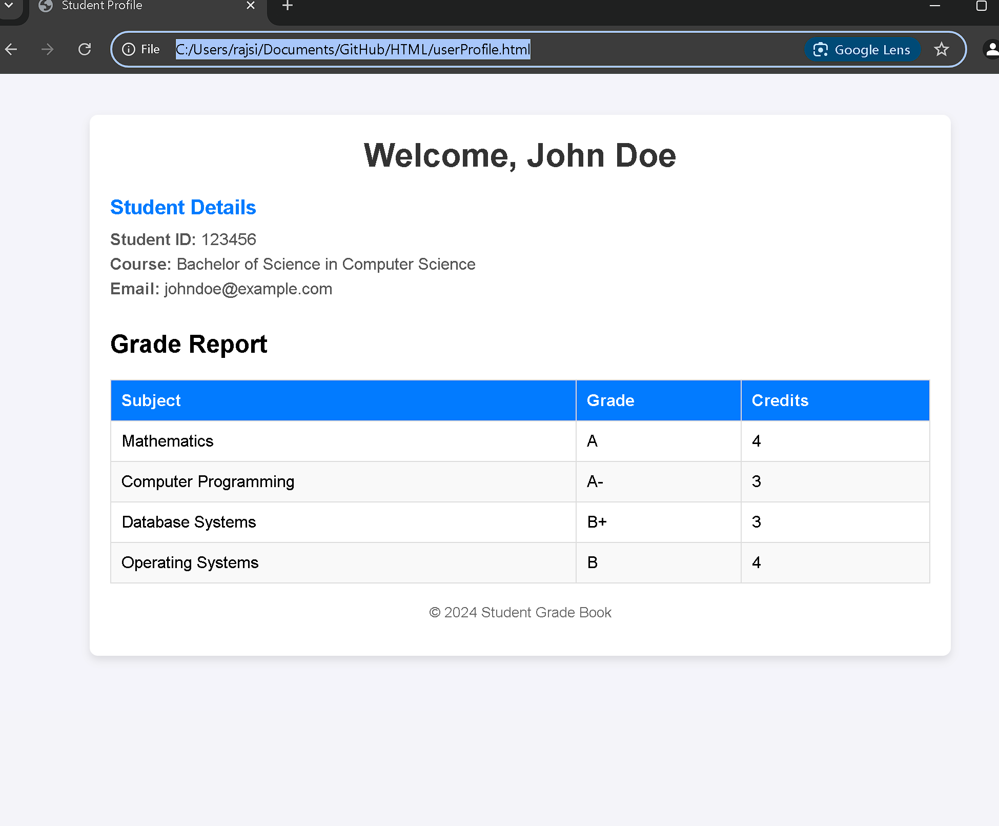
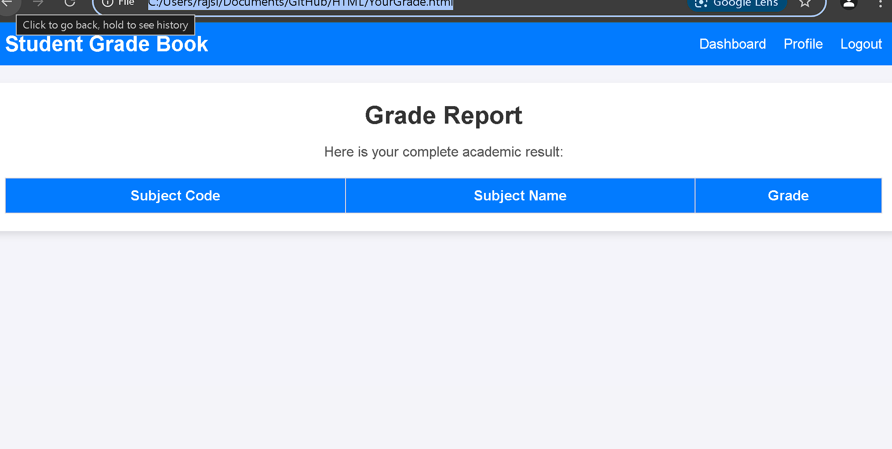
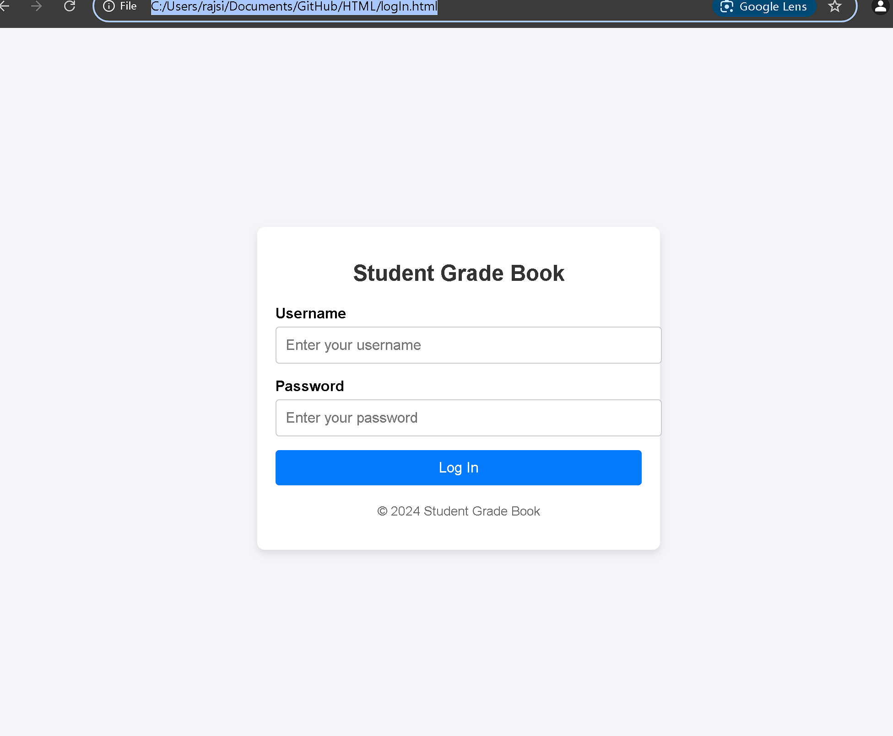

# Team-99
Sure! Here's the README content in code format:

```markdown
# Student Gradebook

## Description
This project provides a flexible way to manage student data, including their grades across multiple subjects. It supports various operations like adding students, updating grades, removing records, sorting by grades or names, and searching for specific student details.

## Features
- Add new students with their details.
- Update grades for existing students.
- Remove student records.
- Sort students by grades or names.
- Search for specific student details.

## Installation
1. Clone the repository:
   ```bash
   git clone https://github.com/yourusername/student-gradebook.git
   ```
2. Navigate to the project directory:
   ```bash
   cd student-gradebook
   ```
3. Install the required dependencies:
   ```bash
   npm install
   ```

## Usage
1. Start the application:
   ```bash
   npm start
   ```
2. Open your browser and navigate to `http://localhost:3000` to use the application.
3. # Student Gradebook Project

## Overview
The Student Gradebook Project is a web application designed to help educators manage and track student grades efficiently. It provides an intuitive interface for adding, editing, and viewing student grades, along with features for managing subjects and generating reports.

## Features
- **User Authentication**:
  - Login and Registration pages with validation.
  - User profiles for personalized settings.

- **Gradebook Management**:
  - Add, edit, and delete student grades.
  - View grade summaries and detailed reports.

- **Dashboard and Reports**:
  - Interactive dashboard with visual charts.
  - Export grade data in CSV format.

- **Responsive Design**:
  - Fully responsive and optimized for various screen sizes.
  - Built with Bootstrap for consistent styling.

## Technologies Used
- **Frontend**:
  - HTML5
  - CSS3
  - Bootstrap
  - JavaScript (for validation and interactivity)

- **Backend**:
  - JAVA.
  
- **Database**:
  - MYSQL.

## Project Structure
  -Login
  -profile
  -dashboard
  -grade


## Contributing
1. Fork the repository.
2. Create a new branch:
   ```bash
   git checkout -b feature-branch
   ```
3. Make your changes and commit them:
   ```bash
   git commit -m "Add new feature"
   ```
4. Push to the branch:
   ```bash
   git push origin feature-branch
   ```





5. Open a pull request.

## License
This project is licensed under the APACHE 2.0 LICENSE.
```

Feel free to copy and paste this into your README file. If you need any more help, just let me know!
